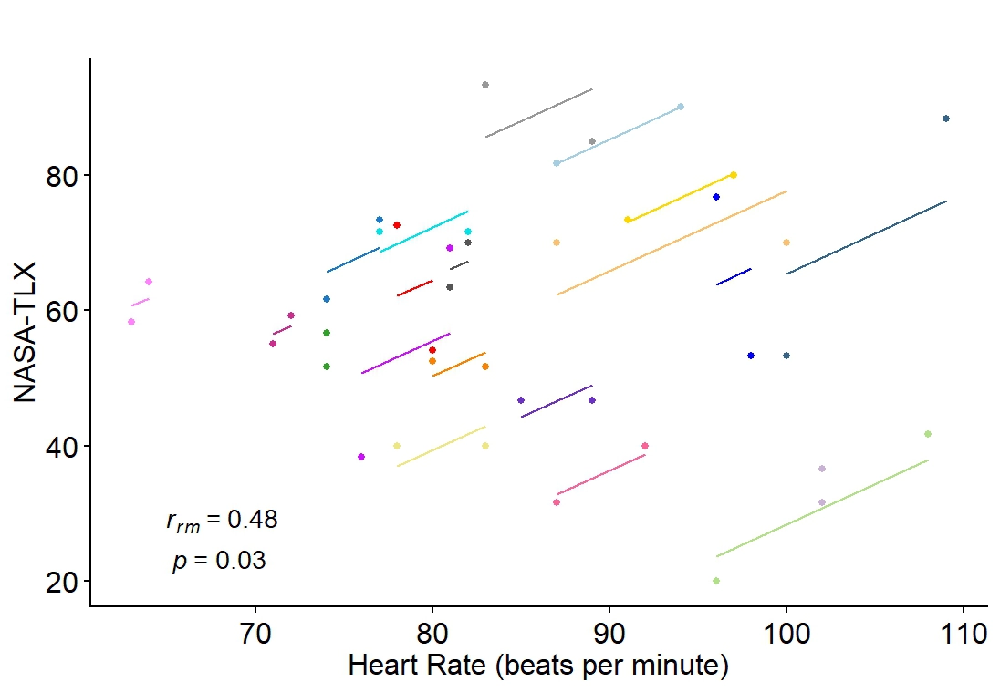
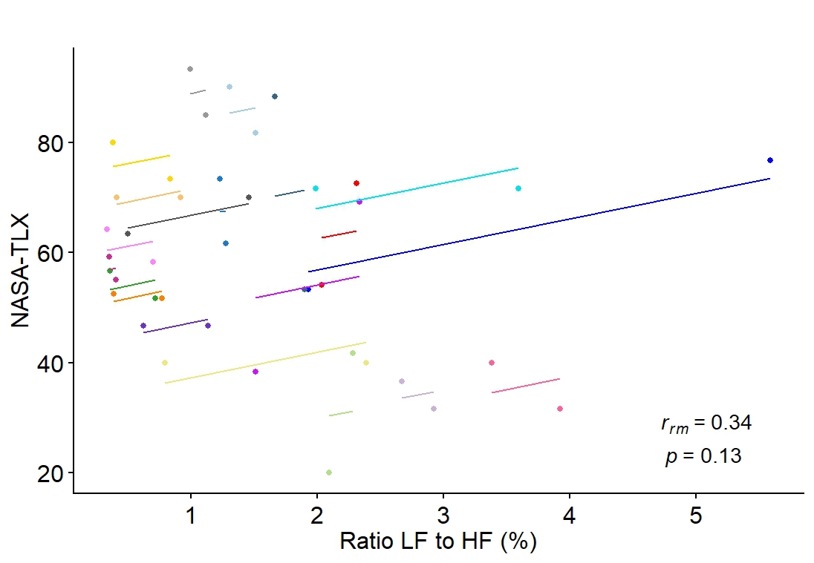

# Mental-Workload
## Overview

Can your smartwatch tell when you're burned out? I tackled this question during 2025 UC Love Data Week, an event focused on discovering, managing, and sharing data. Using R, I examined potential correlations between physiological metrics and mental workload among 20 subjects. I found a significant relationship between heart rate and NASA-TLX scores. Thanks to affordable wearable tech making massive amounts of real-time biological data available to everyone, my work can be used to improve workplace health and safety in the digital age.

**Role:** Data Scientist
**Tools:** Kaggle, R, RStudio
**Dataset:** [Link to Dataset](https://www.kaggle.com/datasets/audityasutarto/heart-rate-variability-and-cognitive-mental-load/data)

### Introduction

Mental workload (MWL) characterises an individual's level of cognitive engagement and effort while performing tasks. As task demand increases, human performance declines. Research shows higher MWL causes increased fatigue, injury, errors and accidents. Mental workload plays a crucial role across different industries, especially in labor-intensive and safety-critical spaces.

Repeated measures correlation (rmcorr) has several advantages over other techniques: it can handle repeated measures data without averaging it. It's helpful for studying how a variable changes within a person over time. By calculating the rmcorr coefficient (rrm), we can examine how an individual's physiology shifts with their mental effort, providing a high-resolution map of human performance under pressure.

### The Dataset

The dataset is from an experiment (Izzah et al., 2022) exploring machine learning models. 30 subjects completed two cognitive tests (d2 Attention Test and Switcher Featuring Task) during which their Heart Rate Variability (HRV) was monitored as a physiological indicator of mental workload. This analysis uses unpublished NASA Task Load Index (TLX) scores, a self-reported measure of perceived mental workload. Higher scores reflect higher engagement of mental workload in each task.

## Hypotheses

Does heart rate significantly correlate with TLX scores across the two cognitive workload tests? Does the low-frequency to high-frequency ratio significantly correlate with TLX scores across these tests? These questions are posed in the form of two null hypotheses:

1. H01 = There is no significant correlation between heart rate and NASA-TLX scores across the two cognitive workload tests
2. H02 = There is no significant correlation between the ratio LF to HF and NASA-TLX scores across the two cognitive workload tests

## Analysis & Results

### Finding 1: Heart Rate Correlates with Mental Workload

A positive intra-individual correlation indicated a significant relationship between heart rate and NASA-TLX scores (rrm (19) = 0.48, 95% CI [0.06, 0.755], p = 0.028) across two different mental workload tests, leading to the rejection of the first null hypothesis. This suggests that higher mental workload was associated with increased heart rate.


*Each participant's data is color-coded with lines representing the rmcorr fit for each individual.*

### Finding 2: LF/HF Ratio is an Unreliable Metric

In contrast, this evidence was insufficient to reject H02 for a significant correlation between the LF to HF ratio and NASA-TLX scores (rrm (19) = 0.34, 95% CI [-0.106, 0.674], p = 0.13). For real-time workload monitoring, heart rate may be a more dependable metric than noisy ratios like LF/HF, which showed higher variability among our 20 subjects.



Heart rate emerged as the stronger physiological signal. Ultimately, this underscores the potential of integrating wearable tech into modern workload assessment frameworks.

<details>
<summary>View Code</summary>
  
```r
# Used to compute repeated measures correlation
install.packages("rmcorr")

# Used for data manipulation
install.packages("dplyr")

# Used for visualizations
install.packages("ggplot2")
install.packages("cowplot")
install.packages("pals")

# Activate packages
library(rmcorr)
library(dplyr)
library(ggplot2)
library(cowplot)
library(pals)

# Load CSV file with semicolon as separator
data_csv <- read.csv("hrv_mwl.csv", sep = ";")

# Compute rmcorr between Heart Rate and NASA-TLX
hr_nasa <- rmcorr(participant=participant, measure1=hr, measure2=nasa, dataset=data_csv)
hr_nasa

# Retain first 20 subjects for visualization clarity
data_clean <- data_csv %>%
  filter(Subject <= 20)

# Compute rmcorr between Heart Rate and NASA-TLX
hr_nasa <- rmcorr(participant=participant, measure1=hr, measure2=nasa, dataset=data_csv)
hr_nasa

# Visualizing plot between HR and NASA-TLX
ggplot(data_clean, aes(x = hr, y = nasa, group = factor(participant), color = factor(participant))) +
  geom_point(aes(colour = factor(participant))) +
  geom_line(aes(y = hr_nasa$model$fitted.values), linetype = 2) +
  ylab("NASA-TLX") +
  xlab("Heart Rate") +
  theme_cowplot() +
  scale_shape_identity() +
  theme(legend.position = "none",
             plot.title = element_text(size = 20, hjust = 0.5),
             axis.title = element_text(size = 15),
             axis.text = element_text(size = 15),
             axis.text.x = element_text(angle = 0, hjust = 0, vjust = 0)) +
  scale_colour_manual(values = cols25(n)) +
  annotate("text",
          x = -Inf,
          y = -Inf,
          size = 5,
          label = deparse(bquote(atop(~~italic(r[rm])~"="~ .(sprintf("%.2f", round(my.rmc$r, 2))),
            ~italic(p)~.(ifelse(my.rmc$p < 0.001, "< 0.001",
                          ifelse(my.rmc$p < 0.01, "< 0.01",
                            ifelse(my.rmc$p < 0.05 & my.rmc$p > 0.045, "< 0.05",
                              paste0("= ",round(my.rmc$p, digits = 2))))))))),
          hjust = -0.5,
          vjust = -0.5,
          parse = TRUE)
